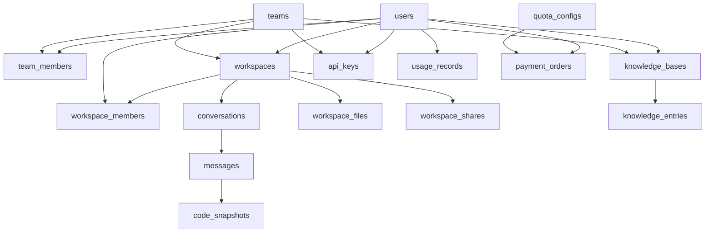
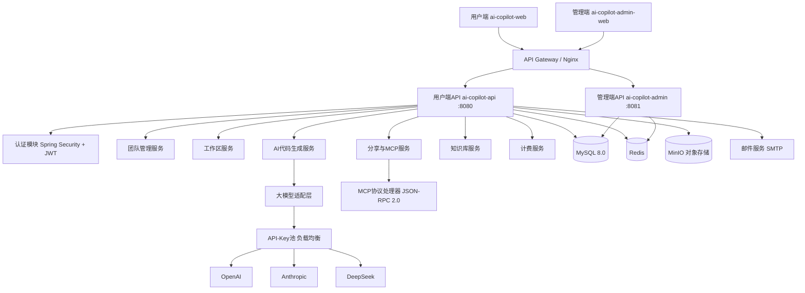
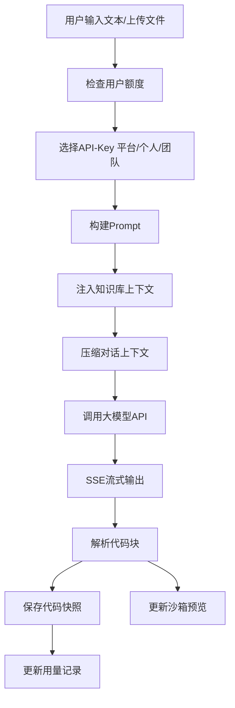

# AI 前端代码生成平台 - 技术方案设计

## 一、系统概述

### 1.1 平台定位
AI驱动的前端代码生成平台，支持通过自然语言描述、文件/图片上传等方式生成高质量的前端代码（React/Vue/TypeScript），并提供沙箱预览、团队协作、知识库管理等能力。同时支持通过MCP协议将生成的代码集成到外部AI工具中。

### 1.2 技术选型

| 层次 | 技术选型 |
|------|---------|
| 前端框架 | React 19 + TypeScript + Vite |
| UI方案 | CSS Modules 自定义样式（用户端和管理端） |
| 状态管理 | Zustand |
| 路由方案 | React Router v7 |
| HTTP客户端 | Axios |
| 后端框架（用户端） | Java 17 + Spring Boot 3.2.5 |
| 后端框架（管理端） | Java 17 + Spring Boot 3.2.5 |
| ORM | MyBatis-Plus 3.5.6 |
| 数据库 | MySQL 8.0+ |
| 缓存 | Redis |
| 对象存储 | MinIO |
| 消息队列 | RabbitMQ（已引入依赖，配置预留） |
| 认证鉴权 | Spring Security + JWT (JJWT 0.12.5) |
| 响应式HTTP | Spring WebFlux（AI流式生成） |
| 邮件服务 | Spring Boot Mail（团队邀请邮件） |
| 沙箱预览 | iframe sandbox + 浏览器端编译 |
| 大模型接入 | 多模型适配层（OpenAI/Anthropic/DeepSeek等） |
| MCP协议 | JSON-RPC 2.0 over Streamable HTTP |
| 工具库 | Hutool 5.8.26、Lombok |
| 部署 | Docker + Kubernetes |

### 1.3 项目结构

```
ai-design/
├── ai-copilot-web/          → 用户端前端 (React + Vite)
├── ai-copilot-admin-web/    → 管理端前端 (React + Vite)
├── ai-copilot-api/          → 用户端后端 (Spring Boot)
├── ai-copilot-admin/        → 管理端后端 (Spring Boot)
└── docs/                    → 项目文档
```

### 1.4 模块总览

```
平台模块
├── 用户与认证模块
├── 团队管理模块
├── 工作区管理模块
├── AI代码生成模块（对话+生成+流式输出）
├── 沙箱预览模块
├── 分享与MCP协议模块
├── 知识库模块
├── API-Key管理模块
├── 用量与计费模块
├── 文件上传模块
└── 运营管理模块
```

---

## 二、功能模块详细设计

### 模块一：用户与认证模块

**功能清单：**
- 用户注册（支持邮箱/手机号，注册时可填写团队邀请码）
- 用户登录（邮箱/手机号+密码）
- 获取当前用户信息
- 刷新Token（预留，待完善）
- 用户MCP令牌管理（自动生成，用于MCP服务端点身份绑定）

### 模块二：团队管理模块

**功能清单：**
- 创建团队
- 获取我的团队列表
- 获取团队详情
- 生成/刷新团队邀请码
- 通过邀请码申请加入团队
- 邮件邀请成员
- 成员加入审核（团队管理员审核通过/拒绝）
- 获取团队成员列表/待审核列表
- 修改成员角色（团队所有者、管理员、普通成员）
- 移除成员
- 退出团队

### 模块三：工作区管理模块

**功能清单：**
- 创建工作区（选择代码语言：React/Vue/TypeScript，生成模式：原型/开发）
- 工作区列表（我创建的+我参与的）
- 获取工作区详情
- 更新/删除工作区
- 获取同团队可添加用户
- 添加协作成员（设置查看/编辑权限）
- 修改成员权限/移除成员
- 获取工作区文件列表

### 模块四：AI代码生成模块

**功能清单：**
- 创建对话会话
- 获取会话列表
- 获取消息历史
- 文本描述生成代码（SSE流式输出）
- 支持多模态（上传图片/文件辅助生成）
- 两种生成模式：
  - 原型模式：快速生成交互原型
  - 开发模式：生成高质量可维护代码
- 原型转开发模式（一键升级）
- 切换生成模式
- 切换API-Key来源（平台/个人/团队）
- 代码版本历史（快照列表 + 快照详情）
- 获取可用模型列表
- 生成选项聚合接口（一次返回平台模型、个人Key、团队Key、付费套餐）
- 对话上下文摘要（滚动压缩）

### 模块五：沙箱预览模块

**功能清单：**
- 实时代码预览（iframe沙箱）
- 浏览器端编译运行（React/Vue/TypeScript）
- 响应式预览（桌面/平板/手机视图）
- 代码导出/下载（ZIP打包，保持文件路径和分层）

### 模块六：分享与MCP协议模块

**功能清单：**
- 创建分享链接（支持指定快照版本或始终最新）
- 通过分享令牌获取预览数据（公开接口，无需登录）
- MCP协议端点（Streamable HTTP，JSON-RPC 2.0）
  - 用户级MCP令牌（绑定到具体用户）
  - `get_code` 工具：通过分享链接获取代码文件
  - 支持指定版本号获取特定版本代码
  - 兼容旧版REST接口（获取最新/指定版本代码）

### 模块七：知识库模块

**功能清单：**
- 获取当前用户可见的所有知识库（个人+团队+公共审核通过）
- 获取公开知识库列表（支持关键词/分类筛选）
- 获取我的知识库列表
- 创建知识库（支持关联团队）
- 更新/删除知识库
- 提交知识库发布审核
- 知识库条目管理（获取列表/创建条目）
- 知识库使用量统计

### 模块八：API-Key管理模块

**功能清单：**
- 个人API-Key管理（增删改查，Key内容加密隐藏）
- 团队API-Key管理（团队维度的Key增删查）
- API-Key池负载均衡（加权轮询、限流、健康检查）
- 生成时选择Key来源：平台模型/个人Key/团队Key

### 模块九：用量与计费模块

**功能清单：**
- 当月用量概览（免费额度使用情况）
- 用量明细查询（分页）
- 可用付费套餐列表
- 套餐配置（免费版/基础版/专业版/团队版）

### 模块十：文件上传模块

**功能清单：**
- 图片上传（用于多模态AI生成）
- 文件上传（参考文档）
- MinIO对象存储

### 模块十一：运营管理模块

**功能清单：**
- 管理员登录（独立登录入口）
- 数据看板（核心指标概览）
- 用户管理（查看/禁用/启用用户）
- 团队管理（查看/禁用团队）
- 知识库审核（审核/通过/拒绝/下架，含平台知识库维护）
- 平台API-Key池管理（增删改查、禁用启用、池状态概览）
- 额度与套餐管理（免费额度配置、付费套餐管理、特殊额度设置）
- 订单管理（查看/退款）
- 系统配置管理
- 操作日志

---

## 三、数据库表结构设计

> 数据库：MySQL 8.0+，字符集 utf8mb4
> 所有表均使用 InnoDB 引擎，支持逻辑删除（deleted字段）

### 3.1 用户与认证

#### users 用户表
| 字段 | 类型 | 说明 |
|------|------|------|
| id | BIGINT PK AUTO_INCREMENT | 主键 |
| email | VARCHAR(255) UNIQUE | 邮箱 |
| phone | VARCHAR(20) UNIQUE | 手机号 |
| password_hash | VARCHAR(255) NOT NULL | 密码哈希 |
| nickname | VARCHAR(100) NOT NULL | 昵称 |
| avatar_url | VARCHAR(500) | 头像URL |
| role | VARCHAR(20) DEFAULT 'user' | 平台角色: admin/user |
| status | VARCHAR(20) DEFAULT 'active' | 状态: active/disabled |
| free_quota_used | INT DEFAULT 0 | 当月已用免费额度(token) |
| free_quota_reset_at | DATETIME | 额度重置时间 |
| mcp_token | VARCHAR(64) UNIQUE | 用户MCP令牌 |
| deleted | TINYINT DEFAULT 0 | 逻辑删除 |
| created_at | DATETIME | 创建时间 |
| updated_at | DATETIME | 更新时间 |

> 索引：idx_email, idx_phone, idx_status

### 3.2 团队管理

#### teams 团队表
| 字段 | 类型 | 说明 |
|------|------|------|
| id | BIGINT PK AUTO_INCREMENT | 主键 |
| name | VARCHAR(100) NOT NULL | 团队名称 |
| description | TEXT | 团队描述 |
| avatar_url | VARCHAR(500) | 团队头像 |
| invite_code | VARCHAR(32) NOT NULL UNIQUE | 邀请码 |
| owner_id | BIGINT NOT NULL | 创建者ID |
| status | VARCHAR(20) DEFAULT 'active' | 状态: active/disabled/dissolved |
| deleted | TINYINT DEFAULT 0 | 逻辑删除 |
| created_at | DATETIME | 创建时间 |
| updated_at | DATETIME | 更新时间 |

> 索引：idx_owner_id, idx_invite_code, idx_status

#### team_members 团队成员表
| 字段 | 类型 | 说明 |
|------|------|------|
| id | BIGINT PK AUTO_INCREMENT | 主键 |
| team_id | BIGINT NOT NULL | 团队ID |
| user_id | BIGINT NOT NULL | 用户ID |
| role | VARCHAR(20) DEFAULT 'member' | 团队角色: owner/admin/member |
| status | VARCHAR(20) DEFAULT 'pending' | 审核状态: pending/approved/rejected |
| joined_at | DATETIME | 通过审核时间 |
| created_at | DATETIME | 创建时间 |

> 唯一索引：uk_team_user(team_id, user_id)
> 索引：idx_user_id, idx_status

### 3.3 工作区管理

#### workspaces 工作区表
| 字段 | 类型 | 说明 |
|------|------|------|
| id | BIGINT PK AUTO_INCREMENT | 主键 |
| name | VARCHAR(200) NOT NULL | 工作区名称 |
| description | TEXT | 描述 |
| code_language | VARCHAR(20) DEFAULT 'react' | 代码语言: react/vue/typescript |
| generation_mode | VARCHAR(20) DEFAULT 'prototype' | 生成模式: prototype/development |
| owner_id | BIGINT NOT NULL | 创建者ID |
| team_id | BIGINT | 所属团队ID（可空） |
| status | VARCHAR(20) DEFAULT 'active' | 状态: active/archived/deleted |
| deleted | TINYINT DEFAULT 0 | 逻辑删除 |
| created_at | DATETIME | 创建时间 |
| updated_at | DATETIME | 更新时间 |

> 索引：idx_owner_id, idx_team_id, idx_status

#### workspace_members 工作区成员表
| 字段 | 类型 | 说明 |
|------|------|------|
| id | BIGINT PK AUTO_INCREMENT | 主键 |
| workspace_id | BIGINT NOT NULL | 工作区ID |
| user_id | BIGINT NOT NULL | 用户ID |
| permission | VARCHAR(20) DEFAULT 'view' | 权限: view/edit |
| created_at | DATETIME | 创建时间 |

> 唯一索引：uk_workspace_user(workspace_id, user_id)
> 索引：idx_user_id

#### workspace_files 工作区文件表
| 字段 | 类型 | 说明 |
|------|------|------|
| id | BIGINT PK AUTO_INCREMENT | 主键 |
| workspace_id | BIGINT NOT NULL | 工作区ID |
| file_path | VARCHAR(500) NOT NULL | 文件路径 |
| file_name | VARCHAR(200) NOT NULL | 文件名 |
| content | LONGTEXT | 文件内容 |
| version | INT DEFAULT 1 | 版本号 |
| created_by | BIGINT NOT NULL | 创建者 |
| created_at | DATETIME | 创建时间 |
| updated_at | DATETIME | 更新时间 |

> 索引：idx_workspace_id

### 3.4 AI对话与代码生成

#### conversations 对话会话表
| 字段 | 类型 | 说明 |
|------|------|------|
| id | BIGINT PK AUTO_INCREMENT | 主键 |
| workspace_id | BIGINT NOT NULL | 工作区ID |
| title | VARCHAR(200) DEFAULT '新对话' | 会话标题 |
| generation_mode | VARCHAR(20) DEFAULT 'prototype' | 生成模式 |
| model_provider | VARCHAR(50) | 模型提供方 |
| api_key_source | VARCHAR(20) DEFAULT 'platform' | Key来源: platform/personal/team |
| api_key_id | BIGINT | 关联的api_key ID |
| context_summary | TEXT | 对话上下文摘要（滚动压缩） |
| created_by | BIGINT NOT NULL | 创建者 |
| deleted | TINYINT DEFAULT 0 | 逻辑删除 |
| created_at | DATETIME | 创建时间 |
| updated_at | DATETIME | 更新时间 |

> 索引：idx_workspace_id, idx_created_by

#### messages 对话消息表
| 字段 | 类型 | 说明 |
|------|------|------|
| id | BIGINT PK AUTO_INCREMENT | 主键 |
| conversation_id | BIGINT NOT NULL | 会话ID |
| role | VARCHAR(20) NOT NULL | 角色: user/assistant/system |
| content | LONGTEXT | 消息内容 |
| attachments | JSON | 附件信息（图片/文件URL列表） |
| token_usage | INT DEFAULT 0 | 消耗token数 |
| model_used | VARCHAR(50) | 使用的模型 |
| code_snapshot_id | BIGINT | 关联的代码快照ID |
| created_at | DATETIME | 创建时间 |

> 索引：idx_conversation_id

#### code_snapshots 代码快照表
| 字段 | 类型 | 说明 |
|------|------|------|
| id | BIGINT PK AUTO_INCREMENT | 主键 |
| workspace_id | BIGINT NOT NULL | 工作区ID |
| conversation_id | BIGINT NOT NULL | 会话ID |
| message_id | BIGINT | 消息ID |
| files | JSON | 文件快照 [{path, name, content}] |
| generation_mode | VARCHAR(20) NOT NULL | 生成模式 |
| version | INT DEFAULT 1 | 版本序号 |
| created_at | DATETIME | 创建时间 |

> 索引：idx_workspace_id, idx_conversation_id

### 3.5 知识库

#### knowledge_bases 知识库表
| 字段 | 类型 | 说明 |
|------|------|------|
| id | BIGINT PK AUTO_INCREMENT | 主键 |
| name | VARCHAR(200) NOT NULL | 知识库名称 |
| description | TEXT | 描述 |
| type | VARCHAR(20) DEFAULT 'user' | 类型: platform/user |
| visibility | VARCHAR(20) DEFAULT 'private' | 可见性: private/public/pending_review |
| owner_id | BIGINT NOT NULL | 创建者ID |
| team_id | BIGINT DEFAULT NULL | 所属团队ID（NULL为个人知识库） |
| category | VARCHAR(100) | 分类 |
| tags | JSON | 标签 |
| review_status | VARCHAR(20) DEFAULT 'none' | 审核状态: none/pending/approved/rejected |
| review_comment | TEXT | 审核意见 |
| reviewed_by | BIGINT | 审核人 |
| reviewed_at | DATETIME | 审核时间 |
| usage_count | BIGINT DEFAULT 0 | 累计使用次数 |
| deleted | TINYINT DEFAULT 0 | 逻辑删除 |
| created_at | DATETIME | 创建时间 |
| updated_at | DATETIME | 更新时间 |

> 索引：idx_owner_id, idx_team_id, idx_type, idx_visibility, idx_review_status

#### knowledge_entries 知识库条目表
| 字段 | 类型 | 说明 |
|------|------|------|
| id | BIGINT PK AUTO_INCREMENT | 主键 |
| knowledge_base_id | BIGINT NOT NULL | 所属知识库ID |
| title | VARCHAR(200) NOT NULL | 条目标题 |
| description | TEXT | 描述 |
| component_name | VARCHAR(100) | 组件名称 |
| code_content | LONGTEXT | 代码内容 |
| code_language | VARCHAR(20) DEFAULT 'react' | 代码语言 |
| preview_url | VARCHAR(500) | 预览图URL |
| tags | JSON | 标签 |
| sort_order | INT DEFAULT 0 | 排序 |
| deleted | TINYINT DEFAULT 0 | 逻辑删除 |
| created_at | DATETIME | 创建时间 |
| updated_at | DATETIME | 更新时间 |

> 索引：idx_knowledge_base_id

### 3.6 API-Key管理

#### api_keys API-Key表
| 字段 | 类型 | 说明 |
|------|------|------|
| id | BIGINT PK AUTO_INCREMENT | 主键 |
| name | VARCHAR(100) NOT NULL | Key名称 |
| scope | VARCHAR(20) NOT NULL | 范围: platform/personal/team |
| owner_type | VARCHAR(20) NOT NULL | 所有者类型: system/user/team |
| owner_id | BIGINT DEFAULT 0 | 所有者ID |
| provider | VARCHAR(50) NOT NULL | 模型提供方 |
| model_name | VARCHAR(50) NOT NULL | 模型名称 |
| api_key_encrypted | TEXT NOT NULL | 加密后的API Key |
| api_base_url | VARCHAR(500) | 自定义API地址 |
| status | VARCHAR(20) DEFAULT 'active' | 状态: active/disabled/exhausted |
| rate_limit | INT DEFAULT 60 | 每分钟限流 |
| weight | INT DEFAULT 1 | 负载权重 |
| total_tokens_used | BIGINT DEFAULT 0 | 累计token |
| last_used_at | DATETIME | 最后使用时间 |
| deleted | TINYINT DEFAULT 0 | 逻辑删除 |
| created_at | DATETIME | 创建时间 |
| updated_at | DATETIME | 更新时间 |

> 索引：idx_scope, idx_owner(owner_type, owner_id), idx_status

### 3.7 用量与计费

#### usage_records 使用量记录表
| 字段 | 类型 | 说明 |
|------|------|------|
| id | BIGINT PK AUTO_INCREMENT | 主键 |
| user_id | BIGINT NOT NULL | 使用者ID |
| team_id | BIGINT | 团队ID |
| workspace_id | BIGINT | 工作区ID |
| conversation_id | BIGINT | 会话ID |
| message_id | BIGINT | 消息ID |
| api_key_source | VARCHAR(20) NOT NULL | Key来源 |
| api_key_id | BIGINT | Key ID |
| model_name | VARCHAR(50) | 模型名称 |
| prompt_tokens | INT DEFAULT 0 | 输入token |
| completion_tokens | INT DEFAULT 0 | 输出token |
| total_tokens | INT DEFAULT 0 | 总token |
| cost_amount | DECIMAL(10,4) DEFAULT 0 | 费用 |
| created_at | DATETIME | 创建时间 |

> 索引：idx_user_created(user_id, created_at), idx_team_id

#### quota_configs 额度配置表
| 字段 | 类型 | 说明 |
|------|------|------|
| id | BIGINT PK AUTO_INCREMENT | 主键 |
| name | VARCHAR(100) NOT NULL | 配置名称 |
| type | VARCHAR(20) NOT NULL | 类型: free/paid |
| target_type | VARCHAR(20) DEFAULT 'default' | 对象: default/user/team |
| target_id | BIGINT DEFAULT 0 | 对象ID |
| monthly_token_limit | BIGINT NOT NULL | 月度token限额 |
| price | DECIMAL(10,2) DEFAULT 0 | 价格 |
| period | VARCHAR(20) DEFAULT 'monthly' | 周期: monthly/yearly |
| status | VARCHAR(20) DEFAULT 'active' | 状态 |
| description | TEXT | 套餐描述 |
| created_at | DATETIME | 创建时间 |
| updated_at | DATETIME | 更新时间 |

> 索引：idx_type, idx_target(target_type, target_id)

#### payment_orders 支付订单表
| 字段 | 类型 | 说明 |
|------|------|------|
| id | BIGINT PK AUTO_INCREMENT | 主键 |
| order_no | VARCHAR(64) NOT NULL UNIQUE | 订单号 |
| user_id | BIGINT NOT NULL | 付款用户 |
| target_type | VARCHAR(20) NOT NULL | 对象类型: user/team |
| target_id | BIGINT NOT NULL | 对象ID |
| quota_config_id | BIGINT NOT NULL | 套餐ID |
| amount | DECIMAL(10,2) NOT NULL | 金额 |
| payment_method | VARCHAR(20) | 支付方式 |
| status | VARCHAR(20) DEFAULT 'pending' | 状态: pending/paid/failed/refunded |
| paid_at | DATETIME | 支付时间 |
| expire_at | DATETIME | 过期时间 |
| created_at | DATETIME | 创建时间 |

> 索引：idx_user_id, idx_order_no, idx_status

### 3.8 分享管理

#### workspace_shares 工作区分享表
| 字段 | 类型 | 说明 |
|------|------|------|
| id | BIGINT PK AUTO_INCREMENT | 主键 |
| workspace_id | BIGINT NOT NULL | 工作区ID |
| share_token | VARCHAR(64) NOT NULL UNIQUE | 分享令牌 |
| snapshot_id | BIGINT | 指定的快照ID（NULL表示最新版本） |
| version | INT | 分享时的版本号 |
| created_by | BIGINT NOT NULL | 分享人ID |
| status | VARCHAR(20) DEFAULT 'active' | 状态: active/disabled |
| created_at | DATETIME | 创建时间 |
| updated_at | DATETIME | 更新时间 |

> 索引：idx_share_token, idx_workspace_id

### 3.9 运营管理

#### operation_logs 操作日志表
| 字段 | 类型 | 说明 |
|------|------|------|
| id | BIGINT PK AUTO_INCREMENT | 主键 |
| operator_id | BIGINT NOT NULL | 操作人ID |
| operator_type | VARCHAR(20) NOT NULL | 类型: admin/user |
| action | VARCHAR(100) NOT NULL | 操作类型 |
| target_type | VARCHAR(50) | 对象类型 |
| target_id | BIGINT | 对象ID |
| detail | JSON | 操作详情 |
| ip | VARCHAR(45) | IP地址 |
| created_at | DATETIME | 操作时间 |

> 索引：idx_operator, idx_created_at

#### system_configs 系统配置表
| 字段 | 类型 | 说明 |
|------|------|------|
| id | BIGINT PK AUTO_INCREMENT | 主键 |
| config_key | VARCHAR(100) NOT NULL UNIQUE | 配置键 |
| config_value | TEXT | 配置值 |
| description | VARCHAR(500) | 说明 |
| updated_by | BIGINT | 修改人 |
| updated_at | DATETIME | 更新时间 |

### 3.10 初始数据

**系统配置初始数据：**

| 配置键 | 说明 | 默认值 |
|--------|------|--------|
| default_free_quota | 默认每月免费token额度 | 100000 |
| max_workspace_per_user | 用户最大工作区数量 | 10 |
| max_team_members | 团队最大成员数 | 50 |
| file_upload_max_size | 文件上传限制(MB) | 10 |
| sandbox_timeout | 沙箱超时时间(秒) | 30 |

**套餐初始数据：**

| 套餐名 | 类型 | 月度Token限额 | 价格 |
|--------|------|:---:|:---:|
| 免费版 | free | 100,000 | 0 |
| 基础版 | paid | 500,000 | ¥29.90 |
| 专业版 | paid | 2,000,000 | ¥99.90 |
| 团队版 | paid | 10,000,000 | ¥399.90 |

### 3.11 ER关系图



---

## 四、用户端后端接口设计（ai-copilot-api）

> 服务端口：8080，上下文路径：`/api/v1`
> 认证方式：Bearer Token (JWT)
> 响应格式：`{ code: number, message: string, data: any }`

### 4.1 认证模块

| 接口 | 方法 | 路径 | 说明 |
|------|------|------|------|
| 用户注册 | POST | /auth/register | 邮箱/手机号注册，可携带团队邀请码 |
| 用户登录 | POST | /auth/login | 邮箱/手机号+密码登录 |
| 获取当前用户 | GET | /auth/me | 获取当前登录用户信息（隐藏密码） |
| 刷新Token | POST | /auth/refresh-token | 刷新JWT Token（待完善） |

### 4.2 团队管理模块

| 接口 | 方法 | 路径 | 说明 |
|------|------|------|------|
| 创建团队 | POST | /teams | 创建新团队 |
| 获取我的团队列表 | GET | /teams | 获取用户加入的所有团队 |
| 获取团队详情 | GET | /teams/:id | 获取团队信息 |
| 刷新邀请码 | POST | /teams/:id/invite-code/refresh | 重新生成邀请码 |
| 获取邀请码 | GET | /teams/:id/invite-code | 获取当前邀请码 |
| 通过邀请码申请加入 | POST | /teams/join | 通过邀请码申请加入团队 |
| 获取团队成员列表 | GET | /teams/:id/members | 获取团队成员列表 |
| 获取待审核申请 | GET | /teams/:id/members/pending | 待审核加入申请 |
| 审核加入申请 | PUT | /teams/:id/members/:userId/review | 审核通过/拒绝 |
| 移除成员 | DELETE | /teams/:id/members/:userId | 移除团队成员 |
| 邮件邀请成员 | POST | /teams/:id/invite | 通过邮件邀请加入团队 |
| 退出团队 | POST | /teams/:id/leave | 用户主动退出团队 |

### 4.3 工作区管理模块

| 接口 | 方法 | 路径 | 说明 |
|------|------|------|------|
| 创建工作区 | POST | /workspaces | 创建工作区 |
| 获取工作区列表 | GET | /workspaces | 我创建的+我参与的 |
| 获取工作区详情 | GET | /workspaces/:id | 获取工作区详细信息 |
| 更新工作区 | PUT | /workspaces/:id | 修改工作区信息 |
| 删除工作区 | DELETE | /workspaces/:id | 删除工作区 |
| 获取同团队可添加用户 | GET | /workspaces/:id/available-members | 可添加的团队成员 |
| 添加协作成员 | POST | /workspaces/:id/members | 添加团队成员到工作区 |
| 修改成员权限 | PUT | /workspaces/:id/members/:userId | 修改查看/编辑权限 |
| 移除协作成员 | DELETE | /workspaces/:id/members/:userId | 移除工作区成员 |
| 获取工作区成员 | GET | /workspaces/:id/members | 获取工作区成员列表 |
| 获取工作区文件列表 | GET | /workspaces/:id/files | 获取文件列表 |

### 4.4 AI对话与代码生成模块

| 接口 | 方法 | 路径 | 说明 |
|------|------|------|------|
| 创建会话 | POST | /workspaces/:wid/conversations | 在工作区内创建对话会话 |
| 获取会话列表 | GET | /workspaces/:wid/conversations | 工作区内所有会话 |
| 获取消息历史 | GET | /conversations/:id/messages | 获取会话消息列表 |
| 生成代码(SSE) | POST | /conversations/:id/generate | SSE流式返回AI生成结果 |
| 切换生成模式 | PUT | /conversations/:id/mode | 切换原型/开发模式 |
| 切换API-Key来源 | PUT | /conversations/:id/api-key | 切换Key来源和Key ID |
| 原型转开发模式 | POST | /conversations/:id/upgrade | 将原型代码升级为开发级代码 |
| 获取代码版本列表 | GET | /conversations/:id/snapshots | 获取快照历史（不含文件内容） |
| 获取快照详情 | GET | /snapshots/:snapshotId | 获取完整快照内容 |
| 下载快照代码(ZIP) | GET | /snapshots/:snapshotId/download | 打包下载为ZIP文件 |
| 获取可用模型列表 | GET | /models/available | 获取平台可用模型 |
| 获取生成选项 | GET | /generation/options | 聚合返回模型、Key、套餐等选项 |

### 4.5 分享与MCP协议模块

| 接口 | 方法 | 路径 | 说明 |
|------|------|------|------|
| 创建分享链接 | POST | /workspaces/:id/share | 生成分享链接（需登录） |
| 获取分享预览 | GET | /share/:token | 通过令牌获取预览数据（公开） |
| MCP协议端点 | POST | /mcp/:mcpToken | MCP Streamable HTTP端点（公开） |
| MCP获取最新代码 | GET | /mcp/:token/latest | 兼容REST接口（公开） |
| MCP获取指定版本 | GET | /mcp/:token/version/:version | 兼容REST接口（公开） |

### 4.6 知识库模块

| 接口 | 方法 | 路径 | 说明 |
|------|------|------|------|
| 获取可见知识库列表 | GET | /knowledge-bases/visible | 个人+团队+公共审核通过 |
| 获取公开知识库列表 | GET | /knowledge-bases/public | 平台+已审核公开知识库 |
| 获取我的知识库列表 | GET | /knowledge-bases/mine | 用户创建的知识库 |
| 获取知识库详情 | GET | /knowledge-bases/:id | 知识库详细信息 |
| 创建知识库 | POST | /knowledge-bases | 创建知识库 |
| 更新知识库 | PUT | /knowledge-bases/:id | 修改知识库信息 |
| 删除知识库 | DELETE | /knowledge-bases/:id | 删除知识库 |
| 提交发布审核 | POST | /knowledge-bases/:id/publish | 提交审核申请 |
| 获取知识库条目列表 | GET | /knowledge-bases/:id/entries | 获取条目列表 |
| 创建知识库条目 | POST | /knowledge-bases/:id/entries | 添加条目 |

### 4.7 API-Key管理模块

| 接口 | 方法 | 路径 | 说明 |
|------|------|------|------|
| 获取个人API-Key列表 | GET | /api-keys/personal | 用户自己的Key列表 |
| 创建个人API-Key | POST | /api-keys/personal | 添加个人Key |
| 修改个人API-Key | PUT | /api-keys/personal/:id | 修改Key信息 |
| 删除个人API-Key | DELETE | /api-keys/personal/:id | 删除Key |
| 获取团队API-Key列表 | GET | /teams/:tid/api-keys | 团队Key列表 |
| 创建团队API-Key | POST | /teams/:tid/api-keys | 添加团队Key |

### 4.8 用量与计费模块

| 接口 | 方法 | 路径 | 说明 |
|------|------|------|------|
| 获取当月用量概览 | GET | /usage/overview | 当月使用量和剩余额度 |
| 获取用量明细 | GET | /usage/records | 分页查询用量明细 |
| 获取可用套餐列表 | GET | /billing/plans | 可购买的付费套餐 |

### 4.9 文件上传模块

| 接口 | 方法 | 路径 | 说明 |
|------|------|------|------|
| 上传文件 | POST | /uploads | 上传图片或文件（type=image/file） |

---

## 五、管理端后端接口设计（ai-copilot-admin）

> 服务端口：8081，上下文路径：`/api/admin/v1`
> 认证方式：Bearer Token (JWT)，仅限 role=admin 的用户访问
> 响应格式：`{ code: number, message: string, data: any }`

### 5.1 管理员认证

| 接口 | 方法 | 路径 | 说明 |
|------|------|------|------|
| 管理员登录 | POST | /auth/login | 管理员登录 |
| 获取管理员信息 | GET | /auth/me | 获取当前管理员信息 |

### 5.2 用户管理

| 接口 | 方法 | 路径 | 说明 |
|------|------|------|------|
| 获取用户列表 | GET | /users | 分页查询，支持关键词/状态筛选 |
| 获取用户详情 | GET | /users/:id | 用户详细信息 |
| 禁用/启用用户 | PUT | /users/:id/status | 修改用户状态 |
| 获取用户用量统计 | GET | /users/:id/usage | 用户使用量统计 |
| 获取用户工作区列表 | GET | /users/:id/workspaces | 用户的工作区 |

### 5.3 团队管理

| 接口 | 方法 | 路径 | 说明 |
|------|------|------|------|
| 获取团队列表 | GET | /teams | 分页查询，支持关键词筛选 |
| 获取团队详情 | GET | /teams/:id | 团队详情及成员统计 |
| 禁用/启用团队 | PUT | /teams/:id/status | 修改团队状态 |
| 获取团队成员 | GET | /teams/:id/members | 查看团队成员列表 |
| 获取团队用量统计 | GET | /teams/:id/usage | 团队使用量统计 |

### 5.4 知识库审核管理

| 接口 | 方法 | 路径 | 说明 |
|------|------|------|------|
| 获取待审核知识库列表 | GET | /knowledge-bases/pending | 待审核列表 |
| 获取所有知识库列表 | GET | /knowledge-bases | 分页查询，支持类型/审核状态筛选 |
| 获取知识库详情 | GET | /knowledge-bases/:id | 知识库详细内容 |
| 获取知识库条目列表 | GET | /knowledge-bases/:id/entries | 审核时查看条目 |
| 审核知识库 | PUT | /knowledge-bases/:id/review | 审核通过/拒绝 |
| 下架公开知识库 | PUT | /knowledge-bases/:id/unpublish | 违规下架 |
| 创建平台知识库 | POST | /knowledge-bases/platform | 创建平台知识库 |
| 添加平台知识库条目 | POST | /knowledge-bases/:id/entries | 添加条目 |
| 删除知识库条目 | DELETE | /knowledge-bases/entries/:entryId | 删除条目 |

### 5.5 平台API-Key池管理

| 接口 | 方法 | 路径 | 说明 |
|------|------|------|------|
| 获取平台Key列表 | GET | /api-keys | 分页查询，支持提供方/状态筛选 |
| 创建平台Key | POST | /api-keys | 添加平台Key |
| 更新平台Key | PUT | /api-keys/:id | 修改Key配置 |
| 删除平台Key | DELETE | /api-keys/:id | 删除Key |
| 禁用/启用Key | PUT | /api-keys/:id/status | 修改Key状态 |
| 获取Key使用统计 | GET | /api-keys/:id/usage | Key使用量统计 |
| 获取Key池状态概览 | GET | /api-keys/pool/status | Key池整体状态 |

### 5.6 额度与套餐配置

| 接口 | 方法 | 路径 | 说明 |
|------|------|------|------|
| 获取免费额度配置 | GET | /quota/free | 获取默认免费额度配置 |
| 修改免费额度配置 | PUT | /quota/free | 修改默认免费额度 |
| 获取付费套餐列表 | GET | /quota/plans | 获取所有套餐 |
| 创建付费套餐 | POST | /quota/plans | 创建新套餐 |
| 更新付费套餐 | PUT | /quota/plans/:id | 修改套餐 |
| 禁用/启用套餐 | PUT | /quota/plans/:id/status | 修改套餐状态 |
| 为用户/团队设置特殊额度 | POST | /quota/special | 设置特殊额度 |
| 获取特殊额度列表 | GET | /quota/special | 查看已设置的特殊额度 |

### 5.7 系统配置

| 接口 | 方法 | 路径 | 说明 |
|------|------|------|------|
| 获取系统配置列表 | GET | /configs | 所有系统配置 |
| 更新系统配置 | PUT | /configs/:key | 修改配置值 |
| 批量更新配置 | PUT | /configs/batch | 批量修改 |
| 新增配置项 | POST | /configs | 新增配置 |

### 5.8 数据统计看板

| 接口 | 方法 | 路径 | 说明 |
|------|------|------|------|
| 获取概览数据 | GET | /dashboard/overview | 核心指标概览 |
| 获取用户增长趋势 | GET | /dashboard/users/trend | 用户注册趋势 |
| 获取模型使用分布 | GET | /dashboard/models/distribution | 各模型使用占比 |

### 5.9 操作日志

| 接口 | 方法 | 路径 | 说明 |
|------|------|------|------|
| 获取操作日志 | GET | /logs | 分页查询操作日志，支持操作类型/目标类型筛选 |
| 导出操作日志 | POST | /logs/export | 导出日志 |

### 5.10 订单管理

| 接口 | 方法 | 路径 | 说明 |
|------|------|------|------|
| 获取订单列表 | GET | /orders | 分页查询，支持状态/订单号筛选 |
| 获取订单详情 | GET | /orders/:id | 订单详情 |
| 手动退款 | POST | /orders/:id/refund | 手动退款操作（仅已支付订单） |

---

## 六、前端页面与交互设计

### 6.1 用户端（ai-copilot-web）

#### 6.1.1 页面路由结构

```
/                               → 首页/落地页 (Home)
/login                          → 登录页
/register                       → 注册页（含邀请码输入）
/share/:token                   → 分享预览页（公开页面，无需登录）
/
├── /dashboard                  → 工作台首页（工作区列表+快速创建）
├── /workspace/:id              → 工作区主界面（对话+生成+预览）
├── /teams                      → 团队列表
│   └── /teams/:id              → 团队详情（成员管理+API-Key管理）
├── /knowledge                  → 知识库列表
│   └── /knowledge/:id          → 知识库详情
├── /api-keys                   → 个人API-Key管理
├── /billing                    → 用量与计费
└── /profile                    → 个人设置
```

#### 6.1.2 核心页面交互设计

**页面1：首页/落地页 (/)**
- 产品介绍和功能展示
- CTA按钮引导注册/登录

**页面2：工作台首页 (/dashboard)**
- 左侧边栏导航：工作台、团队、知识库、API-Key、计费、设置
- 主区域：
  - 快速创建卡片
  - 最近工作区列表（卡片视图/列表视图切换）
  - 每个卡片显示：名称、语言标签、模式标签、更新时间
  - 筛选：全部/我创建的/我参与的

**页面3：工作区主界面 (/workspace/:id) -- 核心页面**

布局：三栏式布局（可拖拽调整宽度）

```
┌──────────────────────────────────────────────────────┐
│ 顶部栏：工作区名称 | 模式切换(原型/开发) | 成员 | 设置 │
├────────┬──────────────────┬──────────────────────────┤
│ 会话   │    对话区域       │     预览/代码区域         │
│ 列表   │                  │                          │
│        │ [AI消息+代码块]  │ ┌─ 预览 ─┬─ 代码 ─┐      │
│ ----   │                  │ │        │        │      │
│ 会话1  │                  │ │ iframe │ 代码   │      │
│ 会话2  │                  │ │ 沙箱   │ 编辑器 │      │
│ 会话3  │                  │ │ 预览   │        │      │
│ +新建  │                  │ └────────┴────────┘      │
│        │                  │ [桌面|平板|手机] [导出]   │
│        ├──────────────────┤                          │
│        │ 输入区域          │                          │
│        │ [文件上传][知识库] │                          │
│        │ [模型选择][发送]  │                          │
└────────┴──────────────────┴──────────────────────────┘
```

交互说明：
- 左栏：会话列表，支持新建、重命名、删除
- 中栏-对话区域：
  - 消息流式展示（Markdown渲染+代码高亮）
  - 输入框支持：文本输入、拖拽/点击上传文件和图片、选择引用知识库
  - 模型/Key选择器：下拉选择平台模型/个人Key/团队Key
  - 发送按钮触发AI生成（SSE流式展示）
- 右栏-预览/代码区域：
  - Tab切换：预览视图 / 代码视图
  - 预览视图：iframe沙箱实时预览，顶部设备切换按钮（桌面/平板/手机）
  - 代码视图：代码编辑器，展示生成的文件树+代码
  - 底部工具栏：版本历史下拉（可回退）、导出按钮、分享按钮
- 顶部操作栏：
  - 生成模式切换：原型模式 ↔ 开发模式
  - "原型转开发"按钮（原型模式下可用）
  - 成员管理按钮
  - 工作区设置

**页面4：团队详情 (/teams/:id)**
- 团队信息卡片：团队名、描述、邀请码（带复制按钮）、刷新邀请码按钮、邮件邀请
- Tab栏：成员管理 | API-Key管理
- 成员管理Tab：待审核列表、成员列表表格
- API-Key管理Tab：Key列表、添加Key按钮

**页面5：知识库 (/knowledge)**
- 知识库列表展示
- 知识库详情页：基本信息 + 条目列表 + 发布审核

**页面6：计费中心 (/billing)**
- 用量概览：当月使用量/总额度进度条
- 套餐信息：可用付费套餐列表

**页面7：分享预览 (/share/:token)**
- 公开访问页面（无需登录）
- 代码预览+沙箱运行

#### 6.1.3 交互特性

| 特性 | 说明 |
|------|------|
| 流式输出 | 对话生成使用SSE，代码逐字符/逐行显示 |
| 实时预览 | 代码变化后自动重新编译预览 |
| 权限控制 | 查看权限：只读；编辑权限：可发消息修改 |
| 文件拖拽 | 支持拖拽上传图片/文件到对话输入框 |
| 响应式预览 | 支持桌面/平板/手机三种视图 |
| 代码下载 | 支持ZIP打包下载，保持文件路径和分层 |

---

### 6.2 管理端（ai-copilot-admin-web）

#### 6.2.1 页面路由结构

```
/login                          → 管理员登录
/
├── /dashboard                  → 数据看板
├── /users                      → 用户管理
├── /teams                      → 团队管理
├── /knowledge                  → 知识库审核管理
├── /api-keys                   → 平台API-Key池管理
├── /quota                      → 额度与套餐管理
├── /orders                     → 订单管理
├── /configs                    → 系统配置
└── /logs                       → 操作日志
```

#### 6.2.2 核心页面交互设计

**页面1：数据看板 (/dashboard)**
- 核心指标卡片：总用户数、今日新增、总团队数、总工作区数、今日生成量

**页面2：用户管理 (/users)**
- 筛选栏：关键词搜索、状态筛选
- 表格：分页展示用户列表
- 操作：查看详情、禁用/启用

**页面3：知识库审核 (/knowledge)**
- 待审核列表+全量知识库列表
- 审核操作：通过/拒绝/下架
- 平台知识库创建和维护

**页面4：平台API-Key池管理 (/api-keys)**
- Key池状态概览卡片
- Key列表：支持提供方和状态筛选
- 操作：增删改、禁用/启用、查看统计

**页面5：套餐管理 (/quota)**
- 免费额度配置
- 付费套餐管理
- 特殊额度管理

**页面6：系统配置 (/configs)**
- 分组展示配置项
- 支持单个修改和批量更新
- 支持新增配置项

**页面7：操作日志 (/logs)**
- 筛选：操作类型、目标类型
- 分页表格展示
- 支持导出

---

## 七、系统架构图



## 八、关键技术方案

### 8.1 AI代码生成流程



### 8.2 API-Key池负载均衡策略

- 加权轮询：根据Key配置的weight字段分配请求
- 限流保护：单Key限制每分钟调用次数（rate_limit字段），超限自动切换
- 健康检查：定期验证Key有效性，自动标记失效Key为exhausted
- 优先级：用户/团队自有Key优先使用，失败时可降级到平台Key
- 重试机制：配置retry-count=3，失败自动重试

### 8.3 沙箱预览方案

- 使用 iframe sandbox 在浏览器端安全运行代码
- 浏览器端编译：支持 React/Vue/TypeScript 代码即时编译
- 安全隔离：沙箱iframe使用sandbox属性限制权限
- 响应式预览：支持桌面(100%)、平板(768px)、手机(375px)三种视图

### 8.4 MCP协议集成

- 基于 JSON-RPC 2.0 over Streamable HTTP 实现
- 协议版本：2024-11-05
- 用户级MCP令牌：每个用户分配唯一 mcp_token，用于端点身份绑定
- 工具列表：提供 `get_code` 工具，通过分享链接获取代码
- 支持从分享链接中自动提取token（正则匹配 `/share/{token}` 或 `/mcp/{token}` 格式）
- 无状态模式：每次请求独立处理，无需维护会话

### 8.5 对话上下文管理

- context_summary 字段存储滚动压缩的对话摘要
- 多轮对话通过上下文摘要保持连贯性
- 避免过长的上下文导致token浪费

### 8.6 代码生成模式差异

| 维度 | 原型模式 | 开发模式 |
|------|----------|----------|
| Prompt策略 | 侧重UI展示和交互效果 | 侧重代码质量和工程规范 |
| 代码风格 | 简洁直观，可包含内联样式 | 模块化、组件化、样式分离 |
| 注释 | 可选 | 必须包含完整注释 |
| 文件结构 | 可单文件 | 标准项目结构 |
| TypeScript | 可选 | 严格类型定义 |
| 适用场景 | 快速验证想法、展示原型 | 直接用于生产开发 |

### 8.7 权限矩阵

| 操作 | 工作区所有者 | 编辑权限成员 | 查看权限成员 |
|------|:---:|:---:|:---:|
| 查看代码和预览 | Y | Y | Y |
| 发送对话消息 | Y | Y | N |
| 修改代码/生成模式 | Y | Y | N |
| 管理工作区成员 | Y | N | N |
| 修改工作区设置 | Y | N | N |
| 删除工作区 | Y | N | N |
| 导出代码 | Y | Y | Y |

---

## 九、接口统计总览

| 模块 | 用户端接口数 | 管理端接口数 |
|------|:---:|:---:|
| 认证 | 4 | 2 |
| 团队管理 | 12 | 5 |
| 工作区管理 | 11 | - |
| AI对话与生成 | 12 | - |
| 分享与MCP | 5 | - |
| 知识库 | 10 | 9 |
| API-Key管理 | 6 | 7 |
| 用量与计费 | 3 | 8 |
| 文件上传 | 1 | - |
| 系统配置 | - | 4 |
| 数据统计 | - | 3 |
| 操作日志 | - | 2 |
| 订单管理 | - | 3 |
| **合计** | **64** | **43** |

---

## 十、前端页面统计总览

| 端 | 页面类别 | 页面数量 |
|------|----------|:---:|
| 用户端 | 首页/落地页 | 1 |
| 用户端 | 认证相关（登录/注册） | 2 |
| 用户端 | 工作台首页 | 1 |
| 用户端 | 工作区主界面 | 1 |
| 用户端 | 团队相关（列表/详情） | 2 |
| 用户端 | 知识库相关（列表/详情） | 2 |
| 用户端 | API-Key管理 | 1 |
| 用户端 | 计费中心 | 1 |
| 用户端 | 个人设置 | 1 |
| 用户端 | 分享预览 | 1 |
| **用户端合计** | | **13** |
| 管理端 | 登录 | 1 |
| 管理端 | 数据看板 | 1 |
| 管理端 | 用户管理 | 1 |
| 管理端 | 团队管理 | 1 |
| 管理端 | 知识库审核管理 | 1 |
| 管理端 | API-Key池管理 | 1 |
| 管理端 | 额度套餐管理 | 1 |
| 管理端 | 订单管理 | 1 |
| 管理端 | 系统配置 | 1 |
| 管理端 | 操作日志 | 1 |
| **管理端合计** | | **10** |
| **总计** | | **23** |