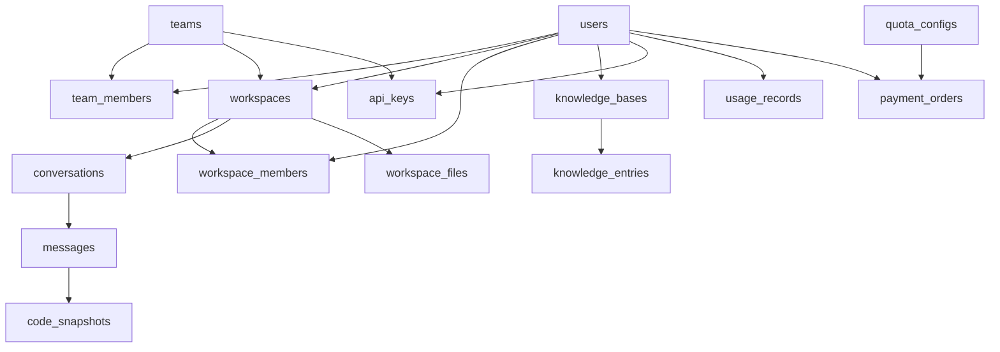
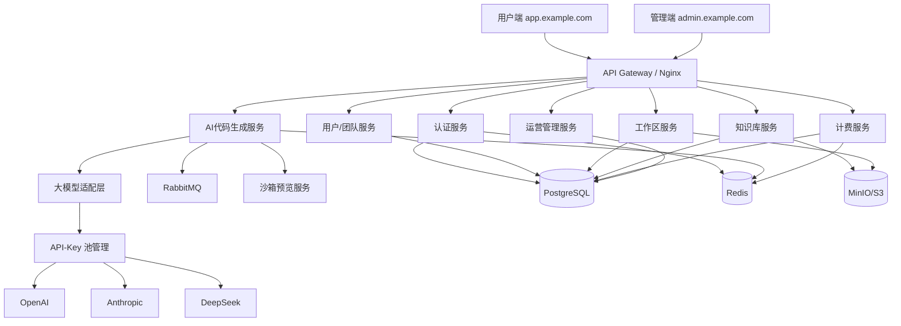
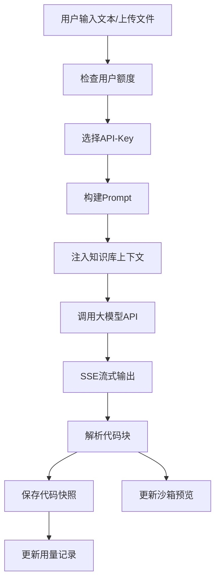

# AI 前端代码生成平台 - 技术方案设计

## 一、系统概述

### 1.1 平台定位
AI驱动的前端代码生成平台，支持通过自然语言描述、文件/图片上传等方式生成高质量的前端代码（React/Vue/TypeScript），并提供沙箱预览、团队协作、知识库管理等能力。

### 1.2 技术选型

| 层次 | 技术选型 |
|------|---------|
| 前端框架 | React + TypeScript + Vite |
| UI组件库 | Ant Design (管理端) / 自定义Design System (用户端) |
| 状态管理 | Zustand |
| 后端框架 | Node.js + NestJS |
| 数据库 | PostgreSQL + Redis |
| 对象存储 | MinIO / S3 |
| 消息队列 | RabbitMQ |
| 沙箱环境 | WebContainer / iframe sandbox |
| 大模型接入 | OpenAI API / 多模型适配层 |
| 部署 | Docker + Kubernetes |
| 域名方案 | 用户端: app.example.com / 管理端: admin.example.com |

### 1.3 模块总览

```
平台模块
├── 用户与认证模块
├── 团队管理模块
├── 工作区管理模块
├── AI代码生成模块（对话+生成）
├── 沙箱预览模块
├── 知识库模块
├── API-Key管理模块
├── 用量与计费模块
└── 运营管理模块
```

---

## 二、功能模块详细设计

### 模块一：用户与认证模块

**功能清单：**
- 用户注册（支持邮箱/手机号，注册时可填写团队邀请码）
- 用户登录（支持邮箱/手机号+密码、OAuth2.0）
- 忘记密码/重置密码
- 个人信息管理（头像、昵称、联系方式）
- 用户角色：平台管理员、普通用户

### 模块二：团队管理模块

**功能清单：**
- 创建团队
- 团队信息管理（名称、描述、头像）
- 生成/刷新团队邀请码
- 邀请成员（通过邀请链接/邀请码）
- 成员加入审核（团队管理员审核）
- 团队成员管理（角色分配：团队所有者、管理员、普通成员）
- 移除成员
- 解散团队
- 用户可加入多个团队

### 模块三：工作区管理模块

**功能清单：**
- 创建工作区（选择代码语言：React/Vue/TypeScript）
- 工作区信息管理（名称、描述、代码语言、生成模式）
- 工作区列表（我创建的、我参与的）
- 添加协作成员（仅同一团队下的用户）
- 设置成员权限（查看权限/编辑权限）
- 移除协作成员
- 删除/归档工作区
- 工作区内文件管理

### 模块四：AI代码生成模块

**功能清单：**
- 创建对话会话
- 文本描述生成代码
- 上传文件（设计稿图片、PDF、Figma链接等）生成代码
- 两种生成模式：
  - 原型模式：快速生成交互原型，关注UI展示和交互逻辑
  - 开发模式：生成高质量、可维护代码，包含注释、规范代码风格
- 原型模式转开发模式：基于已生成的原型代码，升级为开发级代码
- 对话上下文管理（多轮对话修改代码）
- 代码版本历史
- 选择使用的模型/API-Key
- 流式输出代码

### 模块五：沙箱预览模块

**功能清单：**
- 实时代码预览（iframe沙箱）
- 支持React/Vue/TypeScript代码在线编译运行
- 响应式预览（桌面/平板/手机视图）
- 预览分享链接生成
- 代码导出/下载

### 模块六：知识库模块

**功能清单：**
- 平台默认知识库（平台维护的组件库和代码示例）
- 用户创建私有知识库
- 知识库条目管理（添加/编辑/删除组件、代码片段）
- 知识库发布审核（用户提交发布→平台审核→公开）
- 知识库引用（在对话生成时引用知识库中的组件）
- 知识库搜索
- 知识库分类/标签管理

### 模块七：API-Key管理模块

**功能清单：**
- 平台级API-Key池管理（运营管理多个key，负载均衡）
- 用户自有API-Key管理（增删改查，仅自己可用）
- 团队API-Key管理（团队管理员管理，仅团队成员可用）
- 对话时选择API-Key来源：平台模型 / 个人Key / 团队Key
- API-Key有效性验证
- API-Key使用量统计

### 模块八：用量与计费模块

**功能清单：**
- 平台模型使用量统计（按用户/按月）
- 免费额度管理（可配置，按月重置）
- 超额后禁止使用平台模型
- 付费提升限额（按用户/按团队付费）
- 付费套餐管理（可配置不同档位）
- 用量明细查询
- 账单管理

### 模块九：运营管理模块

**功能清单：**
- 用户管理（查看/禁用/启用用户）
- 团队管理（查看/禁用团队）
- 知识库审核（审核用户提交的公开知识库）
- 平台API-Key池管理
- 平台默认知识库维护
- 免费额度/套餐配置
- 系统配置管理
- 数据统计看板（用户数、生成量、使用量等）
- 操作日志

---

## 三、数据库表结构设计

### 3.1 用户与认证

#### users 用户表
| 字段 | 类型 | 说明 |
|------|------|------|
| id | BIGINT PK | 主键 |
| email | VARCHAR(255) | 邮箱（唯一） |
| phone | VARCHAR(20) | 手机号（唯一） |
| password_hash | VARCHAR(255) | 密码哈希 |
| nickname | VARCHAR(100) | 昵称 |
| avatar_url | VARCHAR(500) | 头像URL |
| role | ENUM('admin','user') | 平台角色 |
| status | ENUM('active','disabled') | 账号状态 |
| free_quota_used | INT | 当月已用免费额度(token数) |
| free_quota_reset_at | TIMESTAMP | 额度重置时间 |
| created_at | TIMESTAMP | 创建时间 |
| updated_at | TIMESTAMP | 更新时间 |

### 3.2 团队管理

#### teams 团队表
| 字段 | 类型 | 说明 |
|------|------|------|
| id | BIGINT PK | 主键 |
| name | VARCHAR(100) | 团队名称 |
| description | TEXT | 团队描述 |
| avatar_url | VARCHAR(500) | 团队头像 |
| invite_code | VARCHAR(32) UNIQUE | 邀请码 |
| owner_id | BIGINT FK → users.id | 创建者/所有者 |
| status | ENUM('active','disabled','dissolved') | 团队状态 |
| created_at | TIMESTAMP | 创建时间 |
| updated_at | TIMESTAMP | 更新时间 |

#### team_members 团队成员表
| 字段 | 类型 | 说明 |
|------|------|------|
| id | BIGINT PK | 主键 |
| team_id | BIGINT FK → teams.id | 团队ID |
| user_id | BIGINT FK → users.id | 用户ID |
| role | ENUM('owner','admin','member') | 团队内角色 |
| status | ENUM('pending','approved','rejected') | 审核状态 |
| joined_at | TIMESTAMP | 加入时间 |
| created_at | TIMESTAMP | 创建时间 |

> UNIQUE(team_id, user_id)

### 3.3 工作区管理

#### workspaces 工作区表
| 字段 | 类型 | 说明 |
|------|------|------|
| id | BIGINT PK | 主键 |
| name | VARCHAR(200) | 工作区名称 |
| description | TEXT | 描述 |
| code_language | ENUM('react','vue','typescript') | 代码语言 |
| generation_mode | ENUM('prototype','development') | 当前生成模式 |
| owner_id | BIGINT FK → users.id | 创建者 |
| team_id | BIGINT FK → teams.id | 所属团队（可为空，无团队用户无协作功能） |
| status | ENUM('active','archived','deleted') | 状态 |
| created_at | TIMESTAMP | 创建时间 |
| updated_at | TIMESTAMP | 更新时间 |

#### workspace_members 工作区成员表
| 字段 | 类型 | 说明 |
|------|------|------|
| id | BIGINT PK | 主键 |
| workspace_id | BIGINT FK → workspaces.id | 工作区ID |
| user_id | BIGINT FK → users.id | 用户ID |
| permission | ENUM('view','edit') | 权限类型 |
| created_at | TIMESTAMP | 创建时间 |

> UNIQUE(workspace_id, user_id)

#### workspace_files 工作区文件表
| 字段 | 类型 | 说明 |
|------|------|------|
| id | BIGINT PK | 主键 |
| workspace_id | BIGINT FK → workspaces.id | 工作区ID |
| file_path | VARCHAR(500) | 文件路径（如 src/App.tsx） |
| file_name | VARCHAR(200) | 文件名 |
| content | TEXT | 文件内容 |
| version | INT | 版本号 |
| created_by | BIGINT FK → users.id | 创建者 |
| created_at | TIMESTAMP | 创建时间 |
| updated_at | TIMESTAMP | 更新时间 |

### 3.4 AI对话与代码生成

#### conversations 对话会话表
| 字段 | 类型 | 说明 |
|------|------|------|
| id | BIGINT PK | 主键 |
| workspace_id | BIGINT FK → workspaces.id | 所属工作区 |
| title | VARCHAR(200) | 会话标题 |
| generation_mode | ENUM('prototype','development') | 生成模式 |
| model_provider | VARCHAR(50) | 模型提供方标识 |
| api_key_source | ENUM('platform','personal','team') | Key来源 |
| api_key_id | BIGINT | 引用的api_key记录ID（可为空，平台Key时为空） |
| created_by | BIGINT FK → users.id | 创建者 |
| created_at | TIMESTAMP | 创建时间 |
| updated_at | TIMESTAMP | 更新时间 |

#### messages 对话消息表
| 字段 | 类型 | 说明 |
|------|------|------|
| id | BIGINT PK | 主键 |
| conversation_id | BIGINT FK → conversations.id | 会话ID |
| role | ENUM('user','assistant','system') | 消息角色 |
| content | TEXT | 消息文本内容 |
| attachments | JSONB | 附件信息（图片/文件URL列表） |
| token_usage | INT | 本次消息消耗的token数 |
| model_used | VARCHAR(50) | 使用的模型名称 |
| code_snapshot_id | BIGINT | 关联的代码快照ID |
| created_at | TIMESTAMP | 创建时间 |

#### code_snapshots 代码快照表（版本历史）
| 字段 | 类型 | 说明 |
|------|------|------|
| id | BIGINT PK | 主键 |
| workspace_id | BIGINT FK → workspaces.id | 工作区 |
| conversation_id | BIGINT FK → conversations.id | 关联会话 |
| message_id | BIGINT FK → messages.id | 关联消息 |
| files | JSONB | 文件快照 [{path, name, content}] |
| generation_mode | ENUM('prototype','development') | 生成模式 |
| version | INT | 版本序号 |
| created_at | TIMESTAMP | 创建时间 |

### 3.5 知识库

#### knowledge_bases 知识库表
| 字段 | 类型 | 说明 |
|------|------|------|
| id | BIGINT PK | 主键 |
| name | VARCHAR(200) | 知识库名称 |
| description | TEXT | 描述 |
| type | ENUM('platform','user') | 类型（平台/用户） |
| visibility | ENUM('private','public','pending_review') | 可见性 |
| owner_id | BIGINT FK → users.id | 创建者（平台级时为管理员ID） |
| category | VARCHAR(100) | 分类 |
| tags | JSONB | 标签列表 |
| review_status | ENUM('none','pending','approved','rejected') | 审核状态 |
| review_comment | TEXT | 审核意见 |
| reviewed_by | BIGINT FK → users.id | 审核人 |
| reviewed_at | TIMESTAMP | 审核时间 |
| created_at | TIMESTAMP | 创建时间 |
| updated_at | TIMESTAMP | 更新时间 |

#### knowledge_entries 知识库条目表
| 字段 | 类型 | 说明 |
|------|------|------|
| id | BIGINT PK | 主键 |
| knowledge_base_id | BIGINT FK → knowledge_bases.id | 所属知识库 |
| title | VARCHAR(200) | 条目标题 |
| description | TEXT | 描述 |
| component_name | VARCHAR(100) | 组件名称 |
| code_content | TEXT | 代码内容 |
| code_language | ENUM('react','vue','typescript') | 代码语言 |
| preview_url | VARCHAR(500) | 预览图URL |
| tags | JSONB | 标签 |
| sort_order | INT | 排序 |
| created_at | TIMESTAMP | 创建时间 |
| updated_at | TIMESTAMP | 更新时间 |

### 3.6 API-Key管理

#### api_keys API-Key表
| 字段 | 类型 | 说明 |
|------|------|------|
| id | BIGINT PK | 主键 |
| name | VARCHAR(100) | Key名称/备注 |
| scope | ENUM('platform','personal','team') | 归属范围 |
| owner_type | ENUM('system','user','team') | 所有者类型 |
| owner_id | BIGINT | 所有者ID（user.id / team.id / 0=platform） |
| provider | VARCHAR(50) | 模型提供方（openai/anthropic/deepseek等） |
| model_name | VARCHAR(50) | 模型名称 |
| api_key_encrypted | TEXT | 加密后的API Key |
| api_base_url | VARCHAR(500) | 自定义API地址 |
| status | ENUM('active','disabled','exhausted') | 状态 |
| total_tokens_used | BIGINT | 累计使用token数 |
| last_used_at | TIMESTAMP | 最后使用时间 |
| created_at | TIMESTAMP | 创建时间 |
| updated_at | TIMESTAMP | 更新时间 |

### 3.7 用量与计费

#### usage_records 使用量记录表
| 字段 | 类型 | 说明 |
|------|------|------|
| id | BIGINT PK | 主键 |
| user_id | BIGINT FK → users.id | 使用者 |
| team_id | BIGINT | 所属团队（可为空） |
| workspace_id | BIGINT FK → workspaces.id | 工作区 |
| conversation_id | BIGINT FK → conversations.id | 会话 |
| message_id | BIGINT FK → messages.id | 消息 |
| api_key_source | ENUM('platform','personal','team') | Key来源 |
| api_key_id | BIGINT | 使用的Key ID |
| model_name | VARCHAR(50) | 模型名称 |
| prompt_tokens | INT | 输入token |
| completion_tokens | INT | 输出token |
| total_tokens | INT | 总token数 |
| cost_amount | DECIMAL(10,4) | 费用（元） |
| created_at | TIMESTAMP | 创建时间 |

> INDEX(user_id, created_at) 用于按用户按月统计

#### quota_configs 额度配置表
| 字段 | 类型 | 说明 |
|------|------|------|
| id | BIGINT PK | 主键 |
| name | VARCHAR(100) | 配置名称 |
| type | ENUM('free','paid') | 类型 |
| target_type | ENUM('default','user','team') | 生效对象 |
| target_id | BIGINT | 对象ID（default时为0） |
| monthly_token_limit | BIGINT | 月度token限额 |
| price | DECIMAL(10,2) | 价格（付费套餐时） |
| period | ENUM('monthly','yearly') | 付费周期 |
| status | ENUM('active','disabled') | 状态 |
| created_at | TIMESTAMP | 创建时间 |
| updated_at | TIMESTAMP | 更新时间 |

#### payment_orders 支付订单表
| 字段 | 类型 | 说明 |
|------|------|------|
| id | BIGINT PK | 主键 |
| order_no | VARCHAR(64) UNIQUE | 订单号 |
| user_id | BIGINT FK → users.id | 付款用户 |
| target_type | ENUM('user','team') | 付费对象类型 |
| target_id | BIGINT | 付费对象ID |
| quota_config_id | BIGINT FK → quota_configs.id | 套餐ID |
| amount | DECIMAL(10,2) | 金额 |
| status | ENUM('pending','paid','failed','refunded') | 订单状态 |
| paid_at | TIMESTAMP | 支付时间 |
| expire_at | TIMESTAMP | 套餐过期时间 |
| created_at | TIMESTAMP | 创建时间 |

### 3.8 运营管理

#### operation_logs 操作日志表
| 字段 | 类型 | 说明 |
|------|------|------|
| id | BIGINT PK | 主键 |
| operator_id | BIGINT FK → users.id | 操作人 |
| operator_type | ENUM('admin','user') | 操作人类型 |
| action | VARCHAR(100) | 操作类型 |
| target_type | VARCHAR(50) | 操作对象类型 |
| target_id | BIGINT | 操作对象ID |
| detail | JSONB | 操作详情 |
| ip | VARCHAR(45) | 操作IP |
| created_at | TIMESTAMP | 操作时间 |

#### system_configs 系统配置表
| 字段 | 类型 | 说明 |
|------|------|------|
| id | BIGINT PK | 主键 |
| config_key | VARCHAR(100) UNIQUE | 配置键 |
| config_value | TEXT | 配置值 |
| description | VARCHAR(500) | 配置说明 |
| updated_by | BIGINT FK → users.id | 最后修改人 |
| updated_at | TIMESTAMP | 更新时间 |

### 3.9 ER关系图



---

## 四、用户端后端接口设计（app.example.com/api）

> 所有接口统一前缀：`/api/v1`
> 认证方式：Bearer Token (JWT)
> 响应格式：`{ code: number, message: string, data: any }`

### 4.1 认证模块

| 接口 | 方法 | 路径 | 说明 |
|------|------|------|------|
| 用户注册 | POST | /auth/register | 邮箱/手机号注册，可携带团队邀请码 |
| 用户登录 | POST | /auth/login | 邮箱/手机号+密码登录 |
| OAuth登录 | POST | /auth/oauth/:provider | 第三方OAuth登录 |
| 刷新Token | POST | /auth/refresh-token | 刷新JWT Token |
| 忘记密码 | POST | /auth/forgot-password | 发送重置密码邮件/短信 |
| 重置密码 | POST | /auth/reset-password | 通过验证码重置密码 |
| 获取当前用户 | GET | /auth/me | 获取当前登录用户信息 |
| 修改密码 | PUT | /auth/password | 修改密码（需旧密码） |

**关键接口参数示例：**

```
POST /auth/register
Body: {
  email?: string,
  phone?: string,
  password: string,
  nickname: string,
  invite_code?: string  // 团队邀请码（可选）
}
Response: {
  code: 0,
  data: { user_id, token, refresh_token }
}
```

### 4.2 用户信息模块

| 接口 | 方法 | 路径 | 说明 |
|------|------|------|------|
| 更新个人信息 | PUT | /user/profile | 修改昵称、头像等 |
| 上传头像 | POST | /user/avatar | 上传用户头像 |
| 获取用户用量概览 | GET | /user/usage/overview | 当月使用量、免费额度等 |

### 4.3 团队管理模块

| 接口 | 方法 | 路径 | 说明 |
|------|------|------|------|
| 创建团队 | POST | /teams | 创建新团队 |
| 获取我的团队列表 | GET | /teams | 获取用户加入的所有团队 |
| 获取团队详情 | GET | /teams/:id | 获取团队信息 |
| 更新团队信息 | PUT | /teams/:id | 修改团队名称、描述等 |
| 解散团队 | DELETE | /teams/:id | 解散团队（仅所有者） |
| 刷新邀请码 | POST | /teams/:id/invite-code/refresh | 重新生成邀请码 |
| 获取邀请码 | GET | /teams/:id/invite-code | 获取当前邀请码 |
| 通过邀请码申请加入 | POST | /teams/join | 通过邀请码申请加入团队 |
| 获取团队成员列表 | GET | /teams/:id/members | 获取团队成员列表 |
| 获取待审核申请 | GET | /teams/:id/members/pending | 待审核加入申请 |
| 审核加入申请 | PUT | /teams/:id/members/:userId/review | 审核通过/拒绝 |
| 修改成员角色 | PUT | /teams/:id/members/:userId/role | 修改成员角色 |
| 移除成员 | DELETE | /teams/:id/members/:userId | 移除团队成员 |
| 退出团队 | POST | /teams/:id/leave | 用户主动退出团队 |

**关键接口参数示例：**

```
POST /teams/join
Body: {
  invite_code: string
}
Response: {
  code: 0,
  data: { team_id, status: "pending" }  // 等待审核
}

PUT /teams/:id/members/:userId/review
Body: {
  action: "approve" | "reject",
  comment?: string
}
```

### 4.4 工作区管理模块

| 接口 | 方法 | 路径 | 说明 |
|------|------|------|------|
| 创建工作区 | POST | /workspaces | 创建工作区 |
| 获取工作区列表 | GET | /workspaces | 我创建的+我参与的 |
| 获取工作区详情 | GET | /workspaces/:id | 获取工作区详细信息 |
| 更新工作区 | PUT | /workspaces/:id | 修改工作区信息 |
| 删除/归档工作区 | DELETE | /workspaces/:id | 删除或归档 |
| 获取同团队可添加用户 | GET | /workspaces/:id/available-members | 可添加的团队成员 |
| 添加协作成员 | POST | /workspaces/:id/members | 添加团队成员到工作区 |
| 修改成员权限 | PUT | /workspaces/:id/members/:userId | 修改查看/编辑权限 |
| 移除协作成员 | DELETE | /workspaces/:id/members/:userId | 移除工作区成员 |
| 获取工作区成员 | GET | /workspaces/:id/members | 获取工作区成员列表 |
| 获取工作区文件列表 | GET | /workspaces/:id/files | 获取文件树 |
| 获取文件内容 | GET | /workspaces/:id/files/:fileId | 获取单个文件内容 |
| 导出代码 | POST | /workspaces/:id/export | 导出/下载工作区代码 |

**关键接口参数示例：**

```
POST /workspaces
Body: {
  name: string,
  description?: string,
  code_language: "react" | "vue" | "typescript",
  generation_mode: "prototype" | "development",
  team_id?: number  // 关联团队（可选）
}

POST /workspaces/:id/members
Body: {
  user_id: number,
  permission: "view" | "edit"
}
```

### 4.5 AI对话与代码生成模块

| 接口 | 方法 | 路径 | 说明 |
|------|------|------|------|
| 创建会话 | POST | /workspaces/:wid/conversations | 在工作区内创建对话会话 |
| 获取会话列表 | GET | /workspaces/:wid/conversations | 工作区内所有会话 |
| 获取会话详情 | GET | /conversations/:id | 会话详情 |
| 删除会话 | DELETE | /conversations/:id | 删除对话会话 |
| 发送消息(文本生成) | POST | /conversations/:id/messages | 发送文本描述，AI生成代码 |
| 发送消息(文件生成) | POST | /conversations/:id/messages/with-file | 上传文件/图片，AI生成代码 |
| 获取消息历史 | GET | /conversations/:id/messages | 获取会话消息列表 |
| 流式生成代码 | GET(SSE) | /conversations/:id/stream | SSE流式返回AI生成结果 |
| 切换生成模式 | PUT | /conversations/:id/mode | 切换原型/开发模式 |
| 原型转开发模式 | POST | /conversations/:id/upgrade | 将原型代码升级为开发级代码 |
| 获取代码版本历史 | GET | /conversations/:id/snapshots | 获取代码快照历史 |
| 恢复到某个版本 | POST | /conversations/:id/snapshots/:sid/restore | 恢复到指定版本 |
| 获取可用模型列表 | GET | /models/available | 获取可选模型（平台+个人+团队） |

**关键接口参数示例：**

```
POST /conversations/:id/messages
Body: {
  content: string,          // 用户描述
  generation_mode: "prototype" | "development",
  model_config: {
    source: "platform" | "personal" | "team",
    api_key_id?: number,    // 个人/团队Key时必填
    model_name?: string     // 使用平台模型时指定模型
  },
  knowledge_base_ids?: number[]  // 引用的知识库ID列表
}
Response (SSE stream): {
  event: "code_chunk" | "message" | "done" | "error",
  data: {
    content?: string,
    files?: [{ path, name, content }],
    snapshot_id?: number,
    token_usage?: { prompt, completion, total }
  }
}

POST /conversations/:id/messages/with-file
Body (multipart/form-data): {
  files: File[],            // 上传的图片/文件
  content?: string,         // 附加的文本描述
  generation_mode: "prototype" | "development",
  model_config: { ... },
  knowledge_base_ids?: number[]
}

POST /conversations/:id/upgrade
Body: {
  snapshot_id: number,      // 要升级的原型代码快照ID
  model_config: { ... }
}
Response: 同消息生成SSE流
```

### 4.6 沙箱预览模块

| 接口 | 方法 | 路径 | 说明 |
|------|------|------|------|
| 获取预览配置 | GET | /workspaces/:id/preview | 获取预览所需的代码和配置 |
| 生成分享链接 | POST | /workspaces/:id/share | 生成预览分享链接 |
| 通过分享链接预览 | GET | /share/:token | 公开预览页面（无需登录） |
| 获取预览快照 | GET | /snapshots/:id/preview | 获取某个版本的预览数据 |

### 4.7 知识库模块

| 接口 | 方法 | 路径 | 说明 |
|------|------|------|------|
| 获取公开知识库列表 | GET | /knowledge-bases/public | 平台+已审核公开知识库 |
| 获取我的知识库列表 | GET | /knowledge-bases/mine | 用户创建的知识库 |
| 获取知识库详情 | GET | /knowledge-bases/:id | 知识库详细信息 |
| 创建知识库 | POST | /knowledge-bases | 创建私有知识库 |
| 更新知识库 | PUT | /knowledge-bases/:id | 修改知识库信息 |
| 删除知识库 | DELETE | /knowledge-bases/:id | 删除知识库 |
| 提交知识库发布审核 | POST | /knowledge-bases/:id/publish | 提交审核申请 |
| 获取知识库条目列表 | GET | /knowledge-bases/:id/entries | 获取条目列表 |
| 创建知识库条目 | POST | /knowledge-bases/:id/entries | 添加组件/代码片段 |
| 更新知识库条目 | PUT | /knowledge-entries/:id | 修改条目 |
| 删除知识库条目 | DELETE | /knowledge-entries/:id | 删除条目 |
| 搜索知识库 | GET | /knowledge-bases/search | 全文搜索知识库内容 |

**关键接口参数示例：**

```
POST /knowledge-bases
Body: {
  name: string,
  description?: string,
  category?: string,
  tags?: string[]
}

POST /knowledge-bases/:id/entries
Body: {
  title: string,
  description?: string,
  component_name?: string,
  code_content: string,
  code_language: "react" | "vue" | "typescript",
  preview_image?: File,
  tags?: string[]
}

POST /knowledge-bases/:id/publish
Body: {
  description: string   // 发布说明
}
Response: {
  code: 0,
  data: { review_status: "pending" }
}
```

### 4.8 API-Key管理模块

| 接口 | 方法 | 路径 | 说明 |
|------|------|------|------|
| 获取个人API-Key列表 | GET | /api-keys/personal | 用户自己的Key列表 |
| 创建个人API-Key | POST | /api-keys/personal | 添加个人Key |
| 更新个人API-Key | PUT | /api-keys/personal/:id | 修改Key信息 |
| 删除个人API-Key | DELETE | /api-keys/personal/:id | 删除Key |
| 验证API-Key有效性 | POST | /api-keys/:id/verify | 测试Key是否有效 |
| 获取团队API-Key列表 | GET | /teams/:tid/api-keys | 团队Key列表（管理员可见） |
| 创建团队API-Key | POST | /teams/:tid/api-keys | 添加团队Key |
| 更新团队API-Key | PUT | /teams/:tid/api-keys/:id | 修改团队Key |
| 删除团队API-Key | DELETE | /teams/:tid/api-keys/:id | 删除团队Key |
| 获取Key使用统计 | GET | /api-keys/:id/usage | Key的使用量统计 |

**关键接口参数示例：**

```
POST /api-keys/personal
Body: {
  name: string,           // 备注名称
  provider: string,       // openai / anthropic / deepseek 等
  model_name: string,     // gpt-4 / claude-3 等
  api_key: string,        // API Key（传输后加密存储）
  api_base_url?: string   // 自定义API地址
}
```

### 4.9 用量与计费模块

| 接口 | 方法 | 路径 | 说明 |
|------|------|------|------|
| 获取当月用量概览 | GET | /usage/overview | 当月使用量和剩余额度 |
| 获取用量明细 | GET | /usage/records | 分页查询用量明细 |
| 获取可用套餐列表 | GET | /billing/plans | 可购买的付费套餐 |
| 创建支付订单 | POST | /billing/orders | 创建付费订单 |
| 获取订单列表 | GET | /billing/orders | 查询订单列表 |
| 获取订单详情 | GET | /billing/orders/:id | 查询订单详情 |
| 支付回调 | POST | /billing/callback/:provider | 支付平台回调 |
| 获取团队用量概览 | GET | /teams/:tid/usage/overview | 团队当月用量 |
| 获取团队用量明细 | GET | /teams/:tid/usage/records | 团队用量明细 |

**关键接口参数示例：**

```
GET /usage/overview
Response: {
  code: 0,
  data: {
    month: "2026-04",
    free_quota: { total: 100000, used: 35000, remaining: 65000 },
    paid_quota: { total: 500000, used: 120000, remaining: 380000 },
    current_plan: { name: "Pro", expire_at: "2026-05-01" }
  }
}

POST /billing/orders
Body: {
  plan_id: number,
  target_type: "user" | "team",
  target_id?: number,      // 团队付费时需要
  payment_method: "alipay" | "wechat"
}
```

---

## 五、管理端后端接口设计（admin.example.com/api）

> 所有接口统一前缀：`/api/admin/v1`
> 认证方式：Bearer Token (JWT)，仅限 role=admin 的用户访问
> 响应格式：`{ code: number, message: string, data: any }`

### 5.1 管理员认证

| 接口 | 方法 | 路径 | 说明 |
|------|------|------|------|
| 管理员登录 | POST | /auth/login | 管理员登录（独立登录入口） |
| 获取管理员信息 | GET | /auth/me | 获取当前管理员信息 |
| 修改管理员密码 | PUT | /auth/password | 修改密码 |

### 5.2 用户管理

| 接口 | 方法 | 路径 | 说明 |
|------|------|------|------|
| 获取用户列表 | GET | /users | 分页查询，支持搜索/筛选 |
| 获取用户详情 | GET | /users/:id | 用户详细信息 |
| 禁用/启用用户 | PUT | /users/:id/status | 修改用户状态 |
| 获取用户用量统计 | GET | /users/:id/usage | 用户使用量统计 |
| 获取用户工作区列表 | GET | /users/:id/workspaces | 用户的工作区 |

**关键接口参数示例：**

```
GET /users?page=1&size=20&keyword=test&status=active&sort=created_at:desc
Response: {
  code: 0,
  data: {
    total: 1000,
    items: [{ id, email, phone, nickname, role, status, created_at, ... }]
  }
}
```

### 5.3 团队管理

| 接口 | 方法 | 路径 | 说明 |
|------|------|------|------|
| 获取团队列表 | GET | /teams | 分页查询所有团队 |
| 获取团队详情 | GET | /teams/:id | 团队详情及成员统计 |
| 禁用/启用团队 | PUT | /teams/:id/status | 修改团队状态 |
| 获取团队成员 | GET | /teams/:id/members | 查看团队成员列表 |
| 获取团队用量统计 | GET | /teams/:id/usage | 团队使用量统计 |

### 5.4 知识库审核管理

| 接口 | 方法 | 路径 | 说明 |
|------|------|------|------|
| 获取待审核知识库列表 | GET | /knowledge-bases/pending | 待审核列表 |
| 获取所有知识库列表 | GET | /knowledge-bases | 所有知识库（含各状态） |
| 获取知识库详情 | GET | /knowledge-bases/:id | 知识库详细内容 |
| 获取知识库条目列表 | GET | /knowledge-bases/:id/entries | 审核时查看条目 |
| 审核知识库 | PUT | /knowledge-bases/:id/review | 审核通过/拒绝 |
| 下架公开知识库 | PUT | /knowledge-bases/:id/unpublish | 违规下架 |

**关键接口参数示例：**

```
PUT /knowledge-bases/:id/review
Body: {
  action: "approve" | "reject",
  comment?: string          // 审核意见
}
```

### 5.5 平台默认知识库维护

| 接口 | 方法 | 路径 | 说明 |
|------|------|------|------|
| 获取平台知识库列表 | GET | /platform-knowledge | 平台知识库列表 |
| 创建平台知识库 | POST | /platform-knowledge | 创建平台知识库 |
| 更新平台知识库 | PUT | /platform-knowledge/:id | 修改平台知识库 |
| 删除平台知识库 | DELETE | /platform-knowledge/:id | 删除平台知识库 |
| 管理平台知识库条目 | POST | /platform-knowledge/:id/entries | 添加条目 |
| 更新平台知识库条目 | PUT | /platform-knowledge/entries/:id | 修改条目 |
| 删除平台知识库条目 | DELETE | /platform-knowledge/entries/:id | 删除条目 |

### 5.6 平台API-Key池管理

| 接口 | 方法 | 路径 | 说明 |
|------|------|------|------|
| 获取平台Key列表 | GET | /api-keys | 所有平台Key |
| 创建平台Key | POST | /api-keys | 添加平台Key |
| 更新平台Key | PUT | /api-keys/:id | 修改Key配置 |
| 删除平台Key | DELETE | /api-keys/:id | 删除Key |
| 禁用/启用Key | PUT | /api-keys/:id/status | 修改Key状态 |
| 获取Key使用统计 | GET | /api-keys/:id/usage | Key使用量统计 |
| 获取Key池状态概览 | GET | /api-keys/pool/status | Key池整体状态 |

**关键接口参数示例：**

```
POST /api-keys
Body: {
  name: string,
  provider: string,       // openai / anthropic / deepseek 等
  model_name: string,
  api_key: string,
  api_base_url?: string,
  rate_limit?: number,    // 每分钟调用限制
  weight?: number         // 负载均衡权重
}

GET /api-keys/pool/status
Response: {
  code: 0,
  data: {
    total_keys: 20,
    active_keys: 18,
    disabled_keys: 2,
    providers: [
      { provider: "openai", count: 10, active: 9 },
      { provider: "anthropic", count: 5, active: 5 },
      { provider: "deepseek", count: 5, active: 4 }
    ],
    today_total_calls: 15000,
    today_total_tokens: 2500000
  }
}
```

### 5.7 额度与套餐配置

| 接口 | 方法 | 路径 | 说明 |
|------|------|------|------|
| 获取免费额度配置 | GET | /quota/free | 获取默认免费额度配置 |
| 修改免费额度配置 | PUT | /quota/free | 修改默认免费额度 |
| 获取付费套餐列表 | GET | /quota/plans | 获取所有套餐 |
| 创建付费套餐 | POST | /quota/plans | 创建新套餐 |
| 更新付费套餐 | PUT | /quota/plans/:id | 修改套餐 |
| 禁用/启用套餐 | PUT | /quota/plans/:id/status | 修改套餐状态 |
| 为用户设置特殊额度 | POST | /quota/special | 为特定用户/团队设置特殊额度 |
| 获取特殊额度列表 | GET | /quota/special | 查看已设置的特殊额度 |

**关键接口参数示例：**

```
PUT /quota/free
Body: {
  monthly_token_limit: 100000  // 每月免费token数
}

POST /quota/plans
Body: {
  name: string,
  monthly_token_limit: number,
  price: number,
  period: "monthly" | "yearly",
  description?: string
}

POST /quota/special
Body: {
  target_type: "user" | "team",
  target_id: number,
  monthly_token_limit: number,
  expire_at?: string           // 特殊额度过期时间
}
```

### 5.8 系统配置

| 接口 | 方法 | 路径 | 说明 |
|------|------|------|------|
| 获取系统配置列表 | GET | /configs | 所有系统配置 |
| 更新系统配置 | PUT | /configs/:key | 修改配置值 |
| 批量更新配置 | PUT | /configs/batch | 批量修改 |

**系统配置项示例：**

| 配置键 | 说明 | 默认值 |
|--------|------|--------|
| default_free_quota | 默认每月免费token额度 | 100000 |
| max_workspace_per_user | 用户最大工作区数量 | 10 |
| max_team_members | 团队最大成员数 | 50 |
| supported_models | 平台支持的模型列表 | ["gpt-4","claude-3",...] |
| file_upload_max_size | 文件上传大小限制(MB) | 10 |
| sandbox_timeout | 沙箱超时时间(秒) | 30 |

### 5.9 数据统计看板

| 接口 | 方法 | 路径 | 说明 |
|------|------|------|------|
| 获取概览数据 | GET | /dashboard/overview | 核心指标概览 |
| 获取用户增长趋势 | GET | /dashboard/users/trend | 用户注册趋势 |
| 获取生成量趋势 | GET | /dashboard/generations/trend | 代码生成量趋势 |
| 获取Token使用趋势 | GET | /dashboard/tokens/trend | Token消耗趋势 |
| 获取模型使用分布 | GET | /dashboard/models/distribution | 各模型使用占比 |
| 获取收入统计 | GET | /dashboard/revenue | 收入统计 |

**关键接口参数示例：**

```
GET /dashboard/overview
Response: {
  code: 0,
  data: {
    total_users: 10000,
    today_new_users: 150,
    total_teams: 500,
    total_workspaces: 8000,
    today_generations: 3500,
    today_tokens_used: 5000000,
    monthly_revenue: 50000.00,
    active_paid_users: 1200
  }
}

GET /dashboard/users/trend?range=30d
Response: {
  code: 0,
  data: {
    items: [
      { date: "2026-03-25", new_users: 120, active_users: 3500 },
      ...
    ]
  }
}
```

### 5.10 操作日志

| 接口 | 方法 | 路径 | 说明 |
|------|------|------|------|
| 获取操作日志 | GET | /logs | 分页查询操作日志 |
| 导出操作日志 | POST | /logs/export | 导出日志为CSV |

### 5.11 订单管理

| 接口 | 方法 | 路径 | 说明 |
|------|------|------|------|
| 获取订单列表 | GET | /orders | 所有支付订单 |
| 获取订单详情 | GET | /orders/:id | 订单详情 |
| 手动退款 | POST | /orders/:id/refund | 手动退款操作 |

---

## 六、前端页面与交互设计

### 6.1 用户端（app.example.com）

#### 6.1.1 页面路由结构

```
/login                          → 登录页
/register                       → 注册页（含邀请码输入）
/forgot-password                → 忘记密码
/
├── /dashboard                  → 工作台首页（工作区列表+快速创建）
├── /workspaces/:id             → 工作区详情页（主操作界面）
│   ├── /workspaces/:id/chat    → 对话+代码生成视图
│   └── /workspaces/:id/settings → 工作区设置
├── /teams                      → 团队列表
│   ├── /teams/create           → 创建团队
│   └── /teams/:id              → 团队详情
│       ├── /teams/:id/members  → 成员管理
│       └── /teams/:id/api-keys → 团队API-Key管理
├── /knowledge                  → 知识库
│   ├── /knowledge/explore      → 探索公开知识库
│   ├── /knowledge/mine         → 我的知识库
│   └── /knowledge/:id          → 知识库详情
├── /api-keys                   → 个人API-Key管理
├── /billing                    → 用量与计费
│   ├── /billing/usage          → 使用量统计
│   ├── /billing/plans          → 套餐购买
│   └── /billing/orders         → 订单记录
├── /settings                   → 个人设置
└── /share/:token               → 分享预览页（公开页面）
```

#### 6.1.2 核心页面交互设计

**页面1：工作台首页 (/dashboard)**
- 顶部导航栏：Logo、搜索框、通知图标、用户头像下拉菜单
- 左侧边栏：工作台、团队、知识库、API-Key、计费、设置
- 主区域：
  - 快速创建卡片：大按钮"创建新工作区"
  - 最近工作区列表（卡片视图/列表视图切换）
  - 每个卡片显示：名称、语言标签(React/Vue/TS)、模式标签(原型/开发)、更新时间、成员头像
  - 筛选：全部/我创建的/我参与的/按团队筛选

**页面2：工作区主界面 (/workspaces/:id/chat) -- 核心页面**

布局：三栏式布局（可拖拽调整宽度）

```
┌──────────────────────────────────────────────────────┐
│ 顶部栏：工作区名称 | 模式切换(原型/开发) | 成员 | 设置 │
├────────┬──────────────────┬──────────────────────────┤
│ 会话   │    对话区域       │     预览/代码区域         │
│ 列表   │                  │                          │
│        │ [AI消息+代码块]  │ ┌─ 预览 ─┬─ 代码 ─┐      │
│ ----   │                  │ │        │        │      │
│ 会话1  │                  │ │ iframe │ 代码   │      │
│ 会话2  │                  │ │ 沙箱   │ 编辑器 │      │
│ 会话3  │                  │ │ 预览   │        │      │
│ +新建  │                  │ └────────┴────────┘      │
│        │                  │ [桌面|平板|手机] [导出]   │
│        ├──────────────────┤                          │
│        │ 输入区域          │                          │
│        │ [文件上传][知识库] │                          │
│        │ [模型选择][发送]  │                          │
└────────┴──────────────────┴──────────────────────────┘
```

交互说明：
- 左栏：会话列表，支持新建、重命名、删除
- 中栏-对话区域：
  - 消息流式展示（Markdown渲染+代码高亮）
  - 输入框支持：文本输入、拖拽/点击上传文件和图片、选择引用知识库
  - 模型选择器：下拉选择平台模型/个人Key/团队Key
  - 发送按钮触发AI生成（流式展示）
- 右栏-预览/代码区域：
  - Tab切换：预览视图 / 代码视图
  - 预览视图：iframe沙箱实时预览，顶部设备切换按钮（桌面/平板/手机）
  - 代码视图：Monaco代码编辑器，展示生成的文件树+代码
  - 底部工具栏：版本历史下拉（可回退）、导出按钮、分享按钮
- 顶部操作栏：
  - 生成模式切换：原型模式 ↔ 开发模式
  - "原型转开发"按钮（原型模式下可用）
  - 成员管理按钮（弹出侧栏）
  - 工作区设置

**页面3：团队管理 (/teams/:id)**
- 团队信息卡片：团队名、描述、头像、邀请码（带复制按钮）、刷新邀请码按钮
- Tab栏：成员管理 | API-Key管理
- 成员管理Tab：
  - 待审核列表（有新申请时显示Badge）
  - 成员列表表格：头像、昵称、角色（下拉切换）、加入时间、操作（移除）
- API-Key管理Tab：
  - Key列表：名称、提供方、模型、状态、使用量、操作
  - 添加Key按钮 → 弹窗填写Key信息

**页面4：知识库 (/knowledge)**
- 探索页：卡片瀑布流展示公开知识库，支持搜索和分类筛选
- 我的知识库：列表展示+创建按钮，每项显示审核状态Badge
- 知识库详情页：
  - 基本信息 + 发布按钮（私有→提交审核）
  - 条目列表：组件名、预览图、代码语言、操作（编辑/删除）
  - 添加条目：弹窗/抽屉，包含标题、代码编辑器、预览图上传

**页面5：计费中心 (/billing)**
- 用量概览：仪表盘显示当月使用量/总额度，进度条
- 套餐卡片：免费版、基础版、专业版等（高亮当前套餐）
- 订单记录：表格列表，状态标签

#### 6.1.3 交互特性

| 特性 | 说明 |
|------|------|
| 流式输出 | 对话生成使用SSE，代码逐字符/逐行显示 |
| 实时预览 | 代码变化后自动重新编译预览 |
| 权限控制 | 查看权限用户：只读对话和预览；编辑权限：可发消息修改 |
| 文件拖拽 | 支持拖拽上传图片/文件到对话输入框 |
| 快捷键 | Ctrl+Enter发送、Ctrl+S保存、Ctrl+Z撤回 |
| 响应式 | 支持PC端全功能，平板端简化布局 |

---

### 6.2 管理端（admin.example.com）

#### 6.2.1 页面路由结构

```
/login                          → 管理员登录
/
├── /dashboard                  → 数据看板
├── /users                      → 用户管理
│   └── /users/:id              → 用户详情
├── /teams                      → 团队管理
│   └── /teams/:id              → 团队详情
├── /knowledge                  → 知识库管理
│   ├── /knowledge/review       → 审核管理
│   ├── /knowledge/platform     → 平台知识库维护
│   └── /knowledge/:id          → 知识库详情
├── /api-keys                   → 平台API-Key池管理
├── /quota                      → 额度与套餐管理
│   ├── /quota/plans            → 套餐管理
│   ├── /quota/free             → 免费额度配置
│   └── /quota/special          → 特殊额度管理
├── /orders                     → 订单管理
├── /configs                    → 系统配置
└── /logs                       → 操作日志
```

#### 6.2.2 核心页面交互设计

**页面1：数据看板 (/dashboard)**
- 顶部：4个核心指标卡片
  - 总用户数（今日新增↑）
  - 总团队数
  - 今日生成量
  - 本月收入
- 中间：两列图表
  - 左：用户增长折线图（近30天）
  - 右：Token消耗折线图（近30天）
- 底部：两列图表
  - 左：模型使用分布饼图
  - 右：收入趋势柱状图（近12月）

**页面2：用户管理 (/users)**
- 筛选栏：关键词搜索、状态筛选、注册时间范围
- 表格：ID、邮箱、手机、昵称、状态、团队数、工作区数、注册时间、操作
- 操作：查看详情、禁用/启用
- 用户详情页：基本信息、用量统计图表、工作区列表、所属团队列表

**页面3：知识库审核 (/knowledge/review)**
- 待审核列表：知识库名称、提交者、提交时间、操作
- 点击进入审核详情：
  - 知识库信息预览
  - 条目列表预览（可展开查看代码）
  - 审核操作：通过/拒绝（填写审核意见）

**页面4：平台API-Key池管理 (/api-keys)**
- 顶部：Key池状态概览卡片（总数、活跃数、今日调用量、今日Token消耗）
- 表格：名称、提供方、模型、状态、调用量、Token消耗、最后使用、操作
- 操作：编辑、禁用/启用、查看统计、删除
- 添加按钮→弹窗（填写Key信息、权重、限流配置）

**页面5：套餐管理 (/quota/plans)**
- 免费额度配置卡片：当前默认免费额度，修改按钮
- 套餐列表：名称、月度Token限额、价格、周期、状态、操作
- 操作：编辑、禁用/启用
- 特殊额度Tab：为特定用户/团队设置的特殊额度列表

**页面6：系统配置 (/configs)**
- 分组展示配置项
- 表单编辑（文本、数值、JSON等类型）
- 保存时确认弹窗

**页面7：操作日志 (/logs)**
- 筛选：操作人、操作类型、时间范围
- 表格：操作人、操作类型、目标、详情摘要、IP、时间
- 支持导出CSV

#### 6.2.3 管理端交互特性

| 特性 | 说明 |
|------|------|
| 数据可视化 | ECharts图表展示各类统计数据 |
| 列表操作 | 支持批量操作（批量禁用等） |
| 搜索筛选 | 所有列表页支持多条件组合筛选 |
| 操作确认 | 危险操作（禁用、删除、退款）需二次确认 |
| 权限控制 | 基于管理员角色的功能权限控制 |

---

## 七、系统架构图



## 八、关键技术方案

### 8.1 AI代码生成流程



### 8.2 API-Key池负载均衡策略

- 加权轮询：根据Key配置的权重分配请求
- 健康检查：定期验证Key有效性，自动标记失效Key
- 限流保护：单Key限制每分钟调用次数，超限自动切换到下一个Key
- 优先级：用户/团队自有Key优先使用，失败时可降级到平台Key（需用户同意）

### 8.3 沙箱预览方案

- 使用WebContainer技术（如Stackblitz WebContainer API）在浏览器端运行Node.js
- 备选方案：服务端编译 + iframe安全沙箱渲染
- 安全隔离：沙箱iframe使用sandbox属性限制权限，禁止访问父窗口
- 支持热更新：代码变化时增量编译，快速刷新预览

### 8.4 代码生成模式差异

| 维度 | 原型模式 | 开发模式 |
|------|----------|----------|
| Prompt策略 | 侧重UI展示和交互效果 | 侧重代码质量和工程规范 |
| 代码风格 | 简洁直观，可包含内联样式 | 模块化、组件化、样式分离 |
| 注释 | 可选 | 必须包含完整注释 |
| 文件结构 | 可单文件 | 标准项目结构（组件/样式/类型分离） |
| TypeScript | 可选 | 严格类型定义 |
| 适用场景 | 快速验证想法、展示原型 | 直接用于生产开发 |

### 8.5 权限矩阵

| 操作 | 工作区所有者 | 编辑权限成员 | 查看权限成员 |
|------|:---:|:---:|:---:|
| 查看代码和预览 | Y | Y | Y |
| 发送对话消息 | Y | Y | N |
| 修改代码/生成模式 | Y | Y | N |
| 管理工作区成员 | Y | N | N |
| 修改工作区设置 | Y | N | N |
| 删除工作区 | Y | N | N |
| 导出代码 | Y | Y | Y |

---

## 九、接口统计总览

| 模块 | 用户端接口数 | 管理端接口数 |
|------|:---:|:---:|
| 认证 | 8 | 3 |
| 用户信息 | 3 | 5 |
| 团队管理 | 14 | 5 |
| 工作区管理 | 12 | - |
| AI对话与生成 | 13 | - |
| 沙箱预览 | 4 | - |
| 知识库 | 12 | 13 |
| API-Key管理 | 10 | 7 |
| 用量与计费 | 9 | 11 |
| 系统配置 | - | 3 |
| 数据统计 | - | 6 |
| 操作日志 | - | 2 |
| 订单管理 | - | 3 |
| **合计** | **85** | **58** |

---

## 十、前端页面统计总览

| 端 | 页面类别 | 页面数量 |
|------|----------|:---:|
| 用户端 | 认证相关（登录/注册/忘记密码） | 3 |
| 用户端 | 工作台首页 | 1 |
| 用户端 | 工作区相关（主界面/设置） | 2 |
| 用户端 | 团队相关（列表/创建/详情/成员/Key） | 5 |
| 用户端 | 知识库相关（探索/我的/详情） | 3 |
| 用户端 | API-Key管理 | 1 |
| 用户端 | 计费相关（用量/套餐/订单） | 3 |
| 用户端 | 个人设置 | 1 |
| 用户端 | 分享预览 | 1 |
| **用户端合计** | | **20** |
| 管理端 | 登录 | 1 |
| 管理端 | 数据看板 | 1 |
| 管理端 | 用户管理（列表/详情） | 2 |
| 管理端 | 团队管理（列表/详情） | 2 |
| 管理端 | 知识库管理（审核/平台维护/详情） | 3 |
| 管理端 | API-Key池管理 | 1 |
| 管理端 | 额度套餐管理（套餐/免费额度/特殊额度） | 3 |
| 管理端 | 订单管理 | 1 |
| 管理端 | 系统配置 | 1 |
| 管理端 | 操作日志 | 1 |
| **管理端合计** | | **16** |
| **总计** | | **36** |